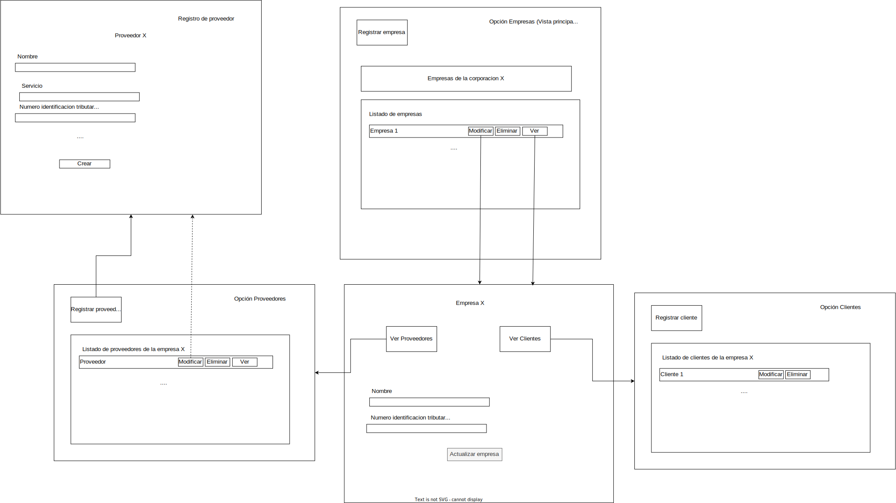

# Notas sobre los diagramas de flujo
- Las vistas de edición y detalle son similares a las vistas de registro, las de registro simplemente no tendrán los inputs rellenos con datos, en el diagrama denoto esto con las lineas que son punteadas. 
- Las vistas de detalle es la misma vista de modificación.
- La vista de detalle de empresa, la que nombro en el diagrama como "Empresa X", es una vista de modificación de datos principales de la empresa
